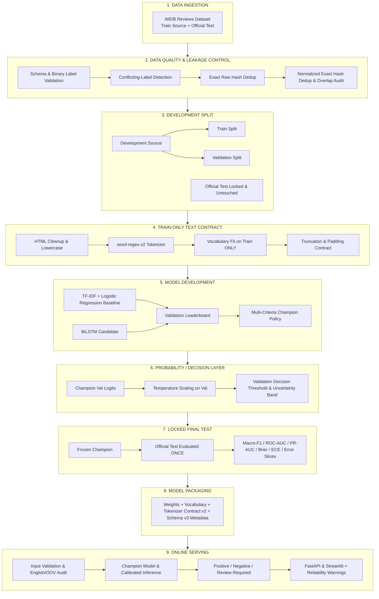

# 🎬 CineSentiment — Leakage-Safe Sentiment Intelligence & NLP Benchmarking Platform

[](https://www.python.org/)
[](https://pytorch.org/)
[](https://fastapi.tiangolo.com/)
[](https://streamlit.io/)
[](https://www.docker.com/)
[](https://github.com/psf/black)

> **CineSentiment** là dịch vụ sentiment tiếng Anh tập trung vào một production
> champion: **BiLSTM đã calibration**. TF-IDF + Logistic Regression là baseline
> bắt buộc để kiểm chứng giá trị; LSTM/GRU chỉ giữ ở `notebooks/legacy/`.

---

## 📌 Pipeline Tóm Tắt Dành Cho CV & Portfolio

```text
IMDB Reviews
  → Data QA & Multi-Level Anti-Leakage (Exact + Normalized SHA256)
  → Train-Only Text Processing Contract
  → TF-IDF Baseline & BiLSTM Candidate
  → Validation Leaderboard & Baseline Release Gate
  → Final Fit on Train + Validation
  → Temperature Scaling & Abstention Policy on Calibration
  → Single-Pass Locked Official Test Evaluation
  → Multi-Slice Error Analysis (Length, OOV, Linguistic Taxonomy)
  → Versioned Artifact Packaging Schema v3
  → Production-Oriented FastAPI & Streamlit Serving
```

---

## 1. Bài Toán & Phạm Vi Ứng Dụng (Problem & Scope)

- **Mục tiêu:** Phân loại cảm xúc đánh giá phim tiếng Anh thành `Positive` (Tích cực) hoặc `Negative` (Tiêu cực).
- **Trọng tâm kỹ thuật:** Không chạy theo việc gom nhặt số lượng lớn các mô hình phức tạp một cách tùy tiện, mà tập trung xây dựng một hệ thống kỹ thuật NLP chuẩn chỉnh:
  $$\text{Data QA} \longrightarrow \text{Leakage Control} \longrightarrow \text{Model Selection} \longrightarrow \text{Calibration} \longrightarrow \text{Final Test} \longrightarrow \text{Serving} \longrightarrow \text{Monitoring}$$
- **Định vị:** Chuyển đổi từ *"Deep Learning Sentiment Classification đơn thuần"* sang **"Sentiment Intelligence Platform — Leakage-Safe NLP Benchmarking, Calibrated Prediction & Production-Oriented Serving"**.

---

## 2. Kiến Trúc 9 Giai Đoạn Chuẩn Mực (Canonical 9-Stage Architecture)

Đây là quy trình kỹ thuật duy nhất chi phối toàn bộ mã nguồn, cấu hình và báo cáo của dự án:



---

## 3. Kiểm Soát Chất Lượng & Chống Rò Rỉ Đa Tầng (Data Quality & Anti-Leakage Policy)

Nhiều dự án NLP thông thường chỉ lọc trùng lặp bằng câu lệnh đơn giản `df.drop_duplicates(subset=['text'])`. Điều này bỏ lọt các trường hợp rò rỉ tinh vi:
- Biến thể viết hoa/thường: `"This movie is GREAT!"` và `"This movie is great"`
- Thẻ định dạng HTML dư thừa: `"This movie is great.<br /><br />"` và `"This movie is great."`
- Khoảng trắng và dấu chấm câu ngoại lai.

### Cơ chế chống rò rỉ 2 tầng:
1. **Exact Raw Text Hash (`compute_raw_hash`):** Băm SHA256 chuỗi văn bản nguyên bản để loại bỏ trùng lặp tuyệt đối.
2. **Normalized Text Hash (`compute_normalized_text_hash`):**
   $$\text{Raw Text} \xrightarrow{\text{HTML Unescape}} \xrightarrow{\text{Strip Tags}} \xrightarrow{\text{Lowercase}} \xrightarrow{\text{Canonical Tokenize}} \text{"this movie is great"} \xrightarrow{\text{SHA256}} \text{Hash}$$
3. **Phát hiện nhãn mâu thuẫn (Conflicting-Label Detection):** Nếu cùng một nội dung (thô hoặc chuẩn hóa) nhưng gán nhãn khác nhau (0 và 1), hệ thống chủ động dừng và báo lỗi `ValueError`, không âm thầm giữ bản ghi đầu tiên.
4. **Loại bỏ Train-Test Overlap:** Tập Test bị loại bỏ hoàn toàn các mẫu trùng khớp với tập Train nguồn trên cả 2 tầng hash trước khi tiến hành phân chia thí nghiệm.

---

## 4. Giao Thức Train / Validation / Test: Loại Bỏ Triệt Để Test Peeking (P0)

> [!CAUTION]
> **Nguyên tắc cốt lõi về Đánh Giá Khách Quan:**
> Không bao giờ dùng tập Test làm tập chọn mô hình (Model Selection Set)!

- **Sai lầm phổ biến:** Huấn luyện LSTM, GRU, BiLSTM, sau đó đánh giá cả 3 mô hình trên tập Test rồi tuyên bố *"BiLSTM tốt nhất trên Test nên ta chọn BiLSTM"*. Thực chất tập Test đã bị biến thành tập chọn mô hình và con số báo cáo bị lạc quan thái quá (Overoptimistic / Data Snooping Bias).
- **Giao thức chuẩn của CineSentiment:**
  1. `train.py` và `baseline.py`: Chỉ huấn luyện trên Train, áp dụng Early Stopping trên Validation, hiệu chuẩn trên Validation và **chỉ xuất `validation_metrics.json`**. Tuyệt đối không chạm vào tập Test!
  2. `compare_models.py`: Đọc duy nhất `validation_metrics.json` từ tất cả các ứng viên để tạo ra `artifacts/development_leaderboard.md` và chọn ra duy nhất một **Champion**.
  3. `evaluate_final.py`: Là script **DUY NHẤT** được ủy quyền mở tập Official Test. Mô hình Champion được đóng băng trọng số, tham số hiệu chuẩn và chỉ được chạy trên Test **đúng 1 lần duy nhất** để sinh ra `artifacts/final_test_report.md`.
- **Quy ước tên gọi:** BiLSTM là cấu hình thực thi mặc định (**default implementation**), chỉ được tuyên bố là mô hình tốt nhất khi có kết quả benchmark thực nghiệm đầy đủ.

---

## 5. Hợp Đồng Xử Lý Văn Bản (Train-Only Text Contract)

- **Phiên bản Tokenizer:** `TOKENIZER_VERSION = "word-regex-v2"`.
- **Bảo toàn từ phủ định:** Regex `[a-z0-9]+(?:'[a-z0-9]+)?` giữ nguyên các từ co cụm phủ định như `don't`, `isn't`, `can't`, `won't`. Phủ định là tín hiệu quyết định trong phân tích cảm xúc, do đó hệ thống không áp dụng stopword removal tùy tiện.
- **Train-Only Vocabulary:** Bộ từ vựng (`Vocabulary`) được xây dựng **CHỈ** từ tập Train (sau khi đã chia Stratified Split). Mọi token chỉ xuất hiện ở Validation hoặc Test được ánh xạ chính xác về token đặc biệt `<UNK>`.
- **Toàn vẹn Train-Serving (Parity Invariant):** Cả quá trình huấn luyện và suy luận trực tuyến đều dùng chung hàm `encode_with_audit`, cam đoan cùng một văn bản sẽ tạo ra danh sách token và chỉ số index giống nhau 100%.

---

## 6. Mô Hình Cơ Sở: TF-IDF + Logistic Regression (First-Class Baseline)

Dự án không coi mô hình tuyến tính là "cho có", mà thiết lập nó thành một đối trọng học thuật mạnh mẽ:
- **Pipeline:** `TfidfVectorizer(ngram_range=(1, 2), min_df=2, sublinear_tf=True)` kết hợp `LogisticRegression(solver='liblinear')`.
- **Câu hỏi kỹ thuật cốt lõi:** *Mạng nơ-ron hồi quy sâu (RNN) có thực sự đem lại giá trị vượt trội so với baseline tuyến tính mạnh mẽ hay không khi xét trên bài toán đánh đổi giữa hiệu năng, kích thước mô hình và độ trễ CPU?*
- **Khả năng giải thích (Explainability):** Trích xuất top các n-gram có trọng số dương và âm lớn nhất từ hệ số hồi quy (kèm lưu ý: tương quan đặc trưng trong dữ liệu không đồng nghĩa với quan hệ nhân quả).

---

## 7. Kiến Trúc Mạng Nơ-ron Hồi Quy (LSTM / GRU / BiLSTM)

Module `SentimentRNN` cung cấp abstraction thống nhất cho cả 3 kiến trúc:
- **Embedding Layer:** Nhúng từ ngữ không gian chiều thấp với `padding_idx` giúp bỏ qua cập nhật gradient tại các vị trí `<PAD>`.
- **Tối ưu hóa Sequence:** Tích hợp `torch.nn.utils.rnn.pack_padded_sequence` với độ dài thực tế của từng câu, loại bỏ hoàn toàn tính toán lãng phí trên vùng padding và tránh làm biến dạng hidden state.
- **BiLSTM Context:** Chiều xuôi và chiều ngược của lớp ẩn cuối cùng được ghép nối (`torch.cat((hidden[-2], hidden[-1]), dim=1)`), nắm bắt ngữ cảnh từ cả hai phía của câu đánh giá.
- **Regularization & Gradient Clipping:** Sử dụng `Dropout`, `AdamW` với Weight Decay và cắt norm gradient `clip_grad_norm_ <= 1.0` phòng chống bùng nổ gradient.

---

## 8. Chính Sách Lựa Chọn Champion (Champion Selection Policy)

Thay vì chỉ chọn mô hình thuần túy theo Accuracy, hệ thống áp dụng bộ tiêu chí đa chiều:

| Nhóm Tiêu Chí | Chỉ Số Đo Lường | Mục Đích |
|---|---|---|
| **Primary Metric** | **Validation Macro-F1** | Đảm bảo cân bằng giữa cả 2 lớp Positive và Negative |
| **Calibration Guardrail** | **Brier Score & ECE** | Ngăn ngừa mô hình tự tin thái quá (overconfident) |
| **Generalization Guardrail**| **Validation Log-Loss** | Đánh giá mức độ trừng phạt các dự đoán sai lệch lớn |
| **Operational Guardrail** | **CPU Latency & Model Params** | Đảm bảo khả năng phục vụ với độ trễ thấp và chi phí tối ưu |
| **Occam's Razor Rule** | **Simplicity Margin ($\Delta \text{F1} < 0.005$)** | Nếu mô hình đơn giản hơn chỉ kém dưới 0.5% F1, ưu tiên mô hình đơn giản |

---

## 9. Tầng Xác Suất & Hiệu Chuẩn (Calibration & Decision Layer - P0)

> [!IMPORTANT]
> Điểm Sigmoid thô của mạng nơ-ron sâu ($\sigma(z)$) **chưa phải là xác suất chuẩn xác**. Mô hình học sâu thường mắc lỗi tự tin thái quá (dự đoán xác suất 0.99 nhưng thực tế sai 10%).

- **Temperature Scaling:** Học một tham số vô hướng $T > 0$ tối ưu trên Calibration Logits để làm mềm phân phối xác suất:
  $$\hat{p} = \sigma\left(\frac{z}{T}\right)$$
- **Các chỉ số đo lường hiệu chuẩn:**
  - **Brier Score:** Sai số bình phương trung bình giữa xác suất dự đoán và nhãn thực tế.
  - **Expected Calibration Error (ECE):** Độ lệch trung bình có trọng số giữa độ tin cậy và độ chính xác thực tế qua 10 bins xác suất.
- **Selective classification:** threshold phân loại là 0.5; `confidence = max(p, 1-p)`. Calibration chọn `confidence_threshold = τ`; confidence dưới τ được trả về `review_required`.

---

## 10. Giao Thức Đánh Giá Locked Final Test

Báo cáo chính thức được xuất ra `artifacts/final_test_report.md` sau khi chạy `python evaluate_final.py`:
- Đo lường đồng thời: Accuracy, Macro-F1, ROC-AUC, PR-AUC, Brier Score, ECE, Log Loss.
- Ma trận nhầm lẫn (Confusion Matrix).
- Phân tích hiệu năng theo các lát cắt độ dài.

---

## 11. Phân Tích Lỗi & Taxonomy Ngôn Ngữ Học (Error Analysis)

Dự án không dừng lại ở con số tổng thể mà mổ xẻ các nhóm lỗi điển hình thông qua `analyze_errors.py`:
- **Phủ định (Negation):** Các mẫu chứa `not`, `n't`, `never`, `hardly` (ví dụ: *"not bad at all"* bị mô hình hiểu nhầm thành tiêu cực do có từ `bad`).
- **Mỉa mai (Sarcasm / Irony):** Sử dụng từ vựng tích cực với hàm ý châm biếm (ví dụ: *"Yeah, that was two hours well spent..."*).
- **Cảm xúc hỗn hợp (Mixed Sentiment):** Chứa liên từ đảo nghĩa `but`, `however`, `although` (ví dụ: *"Great acting, terrible story"*).
- **Đảo chiều cảm xúc (Sentiment Reversal):** Mở đầu khen ngợi nhưng kết luận tiêu cực ở cuối (ví dụ: *"At first I loved it... but the ending ruined everything"*).
- **Từ nhấn mạnh (Intensifiers):** `absolutely`, `totally`, `utterly`.

---

## 12. Độ Bền Vững, Truncation & Kiểm Toán OOV (Robustness Audit)

- **Audit Phân Phối Độ Dài Token:** Báo cáo các phân vị $p_{50}, p_{90}, p_{95}, \max$ và tỷ lệ cắt chuỗi ($\text{truncation\_rate} = \% \text{ review} > \text{max\_length}$).
- **Chiến Lược Cắt Chuỗi (Truncation Strategies):**
  - `first`: Lấy $N$ token đầu câu.
  - `head_tail`: Lấy $N/2$ token đầu kết hợp $N/2$ token cuối câu (nắm bắt kết luận quan trọng của người xem phim ở đoạn kết).
- **Kiểm toán OOV:** Đo lường tỷ lệ token ngoài từ điển (Train OOV, Val OOV, Test OOV).

---

## 13. Phục Vụ Trực Tuyến: REST API & Streamlit (Serving Layer)

### REST API (FastAPI)
- **Chuẩn hóa thông điệp:** Phân biệt rõ giữa `positive_probability` (đã hiệu chuẩn) và `positive_score` (sigmoid thô).
- **Cảnh báo độ tin cậy thời gian thực:** Tự động phát hiện và gắn cờ:
  - `TRUNCATED_INPUT`: Câu vượt độ dài `max_length`.
  - `HIGH_OOV_WARNING`: Câu có tỷ lệ từ lạ vượt 20%.
  - `NON_ENGLISH_WARNING`: Câu không phải tiếng Anh hoặc tỷ lệ ký tự lạ cao.
- **Endpoints:**
  - `GET /health` & `GET /ready`: Giám sát sẵn sàng phục vụ.
  - `GET /metrics`: Metric Prometheus (request count, latency, errors).
  - `GET /info`: Siêu tham số mô hình, temperature và kích thước từ điển.
  - `POST /predict`: Phân tích câu đơn kèm kiểm toán.
  - `POST /predict/batch`: Phân tích theo lô (tối đa 100 câu).

### Streamlit Web App
- Giao diện trực quan 3 tab:
  1. Phân tích câu đơn với thanh đo xác suất hiệu chuẩn, badge quyết định và cảnh báo độ tin cậy.
  2. Phân tích theo lô với bảng thống kê số token và cờ bất định.
  3. Trình bày sơ đồ 9 giai đoạn, Development Leaderboard và Báo cáo Final Test.

---

## 14. Giám Sát & Phát Hiện Trôi Dạt Dữ Liệu (Monitoring Roadmap)

- **HTTP Metrics:** Theo dõi tổng số request, tỷ lệ lỗi và độ trễ $p_{50}, p_{95}$.
- **Model Layer Metrics (Privacy-Safe):**
  - Tỷ lệ Positive / Negative theo thời gian.
  - Phân phối độ dài chuỗi đầu vào và tỷ lệ cắt chuỗi (Truncation rate).
  - Tỷ lệ từ ngoài từ điển (OOV rate).
  - Phân phối điểm tin cậy và số lượng dự đoán rơi vào vùng bất định (`review_required`).
- **Data Drift Detection (Roadmap P2):** Sử dụng kiểm định PSI (Population Stability Index) hoặc Jensen-Shannon Divergence để so sánh phân phối độ dài và OOV giữa dữ liệu online và tập Train tham chiếu.

---

## 15. Đóng Gói Artifact Schema Version 3 & Tính Tái Lập

Checkpoint `model.pt` tuân thủ chuẩn siêu dữ liệu Version 3:

```json
{
  "artifact_schema_version": 3,
  "model_type": "bilstm",
  "tokenizer_version": "word-regex-v2",
  "vocabulary_hash": "a4f8...c1e9",
  "training_data_hash": "e9b2...4f31",
  "decision_threshold": 0.5,
  "temperature": 1.1452,
  "torch_version": "2.6.0",
  "test_protocol": "imdb-official-v1",
  "config": { ... },
  "vocabulary": { ... },
  "model_state": { ... }
}
```

---

## 16. Giới Hạn, Ranh Giới Miền & Đạo Đức AI

- **Ranh giới miền dữ liệu (Domain Boundary):** Mô hình được huấn luyện chuyên biệt trên tập dữ liệu đánh giá phim tiếng Anh (IMDB). Không phù hợp cho văn bản đa ngôn ngữ hoặc văn bản ngoài miền đánh giá điện ảnh.
- **Rủi ro phân loại:** Mô hình có thể dự đoán sai trong các trường hợp cảm xúc đảo chiều phức tạp hoặc mỉa mai tinh vi.
- **Khuyến nghị sử dụng:** Phù hợp cho việc phân tích xu hướng đánh giá, portfolio học thuật; không dùng cho việc ra quyết định tự động ảnh hưởng trực tiếp đến quyền lợi con người mà không có sự giám sát.

---

## 17. Lộ Trình Mở Rộng Reference Transformer (Roadmap P2)

- **Modern Benchmark Reference:** Xây dựng nhánh tham chiếu nhẹ nhàng với `DistilBERT` hoặc `MiniLM` để xác định mức trần hiệu năng (performance ceiling) của Transformer hiện đại.
- **Ablation GloVe Embedding:** So sánh giữa Embedding khởi tạo ngẫu nhiên từ đầu với Pretrained GloVe 100d.
- **Thông điệp học thuật:** *Mô hình RNN được lưu giữ như một kiến trúc baseline tuần tự nhẹ nhàng, tiết kiệm tài nguyên và phục vụ mục đích giáo dục chuyên sâu, trong khi mô hình Transformer xác định mốc trần hiệu năng hiện đại.*

---

## 📁 Cấu Trúc Thư Mục Dự Án (Project Structure)

```text
.
├── sentiment/                  # Core NLP Package
│   ├── __init__.py             # Package initializer
│   ├── config.py               # ExperimentConfig (dataclass, validation, temperature)
│   ├── text.py                 # word-regex-v2, Exact & Normalized SHA256, Vocabulary
│   ├── data_validation.py      # Schema check, Conflicting label, Anti-leakage dedup
│   ├── data.py                 # IMDBDataset, DataLoader, DataBundle & Audit stats
│   ├── model.py                # SentimentRNN (LSTM, GRU, BiLSTM with pack_padded_sequence)
│   ├── calibration.py          # TemperatureScaler, Brier, ECE, DecisionPolicy
│   ├── engine.py               # Training loop, Early stopping, Comprehensive evaluation
│   ├── inference.py            # SentimentPredictor with calibration & reliability audit
│   ├── artifacts.py            # Artifact Schema v3, plots & reliability diagrams
│   └── utils.py                # Reproducibility seed, device selector, latency benchmark
├── tests/                      # Pytest suite
│   ├── test_invariants.py      # 14 kiểm thử bất biến kiến trúc và anti-leakage
│   ├── test_api.py             # Kiểm thử FastAPI endpoints
│   ├── test_baseline.py        # Kiểm thử TF-IDF Logistic baseline
│   ├── test_compare_models.py  # Kiểm thử Leaderboard generation
│   ├── test_data.py            # Kiểm thử data loading & preprocessing
│   ├── test_inference.py       # Kiểm thử inference & predictions
│   └── ...
├── app.py                      # Streamlit Web Platform đa tab
├── api.py                      # FastAPI REST Server (Production-oriented)
├── train.py                    # CLI huấn luyện & validation (Validation-only)
├── baseline.py                 # CLI huấn luyện TF-IDF baseline & explainability
├── compare_models.py           # CLI tổng hợp Development Leaderboard & chọn Champion
├── evaluate_final.py           # CLI DUY NHẤT mở locked Test cho Champion
├── analyze_errors.py           # CLI phân tích lát cắt lỗi & linguistic taxonomy
├── predict.py                  # CLI suy luận nhanh câu đơn
├── load_test.py                # CLI kiểm tra tải đồng thời API
├── download_data.py            # Script chuẩn bị dữ liệu mẫu
├── Dockerfile                  # Container hóa REST API
├── MODEL_CARD.md               # Model Card chi tiết
├── DATASET_CARD.md              # Dataset Card & Anti-leakage audit
└── requirements.txt            # Thư viện phụ thuộc
```

---

## 🚀 Hướng Dẫn Cài Đặt & Chạy Thử Nghiệm

### 1. Cài đặt môi trường
```bash
# Tạo môi trường ảo
python -m venv .venv

# Kích hoạt môi trường (Windows PowerShell)
.venv\Scripts\Activate.ps1

# Kích hoạt môi trường (macOS / Linux)
source .venv/bin/activate

# Cài đặt thư viện
pip install -r requirements.txt
```

### 2. Chạy bộ kiểm thử Invariants (Unit Testing)
```bash
python -m pytest
```

### 3. Huấn luyện First-Class Baseline (TF-IDF + Logistic Regression)
```bash
python baseline.py --output-dir artifacts/baseline
```

### 4. Huấn luyện các mô hình ứng viên (Validation-Only Protocol)
```bash
# Huấn luyện BiLSTM trên Train/Validation/Calibration; không có test flag
python train.py --epochs 15 --batch-size 128 --output-dir runs/dev_bilstm
```

### 5. So sánh trên Validation & Chọn Champion
```bash
python compare_models.py
```
*Kết quả xuất tại `artifacts/development_leaderboard.md`.*

### 6. Mở Locked Test cho Champion duy nhất
```bash
python -m scripts.final_fit
python -m scripts.calibrate
python -m scripts.evaluate_release
```
*Kết quả release nằm tại `artifacts/releases/v1.0.0/`; Official Test chỉ được đọc ở bước cuối.*

### 7. Khởi chạy Web App & REST API
```bash
# Khởi chạy giao diện Streamlit
streamlit run app.py

# Khởi chạy REST API Server
uvicorn api:app --reload --port 8000
```

---

## 📝 Giấy Phép & Tác Giả

- **Tác giả:** AI / MLOps Engineer Candidate
- **Giấy phép:** MIT License. Sử dụng tự do cho mục đích nghiên cứu, học tập và xây dựng Portfolio chuyên nghiệp.
